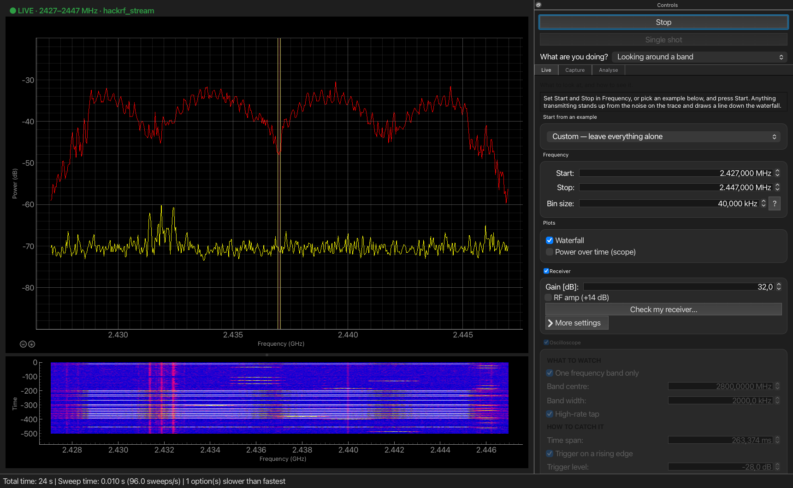
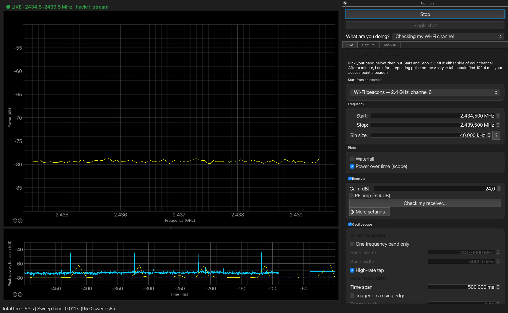
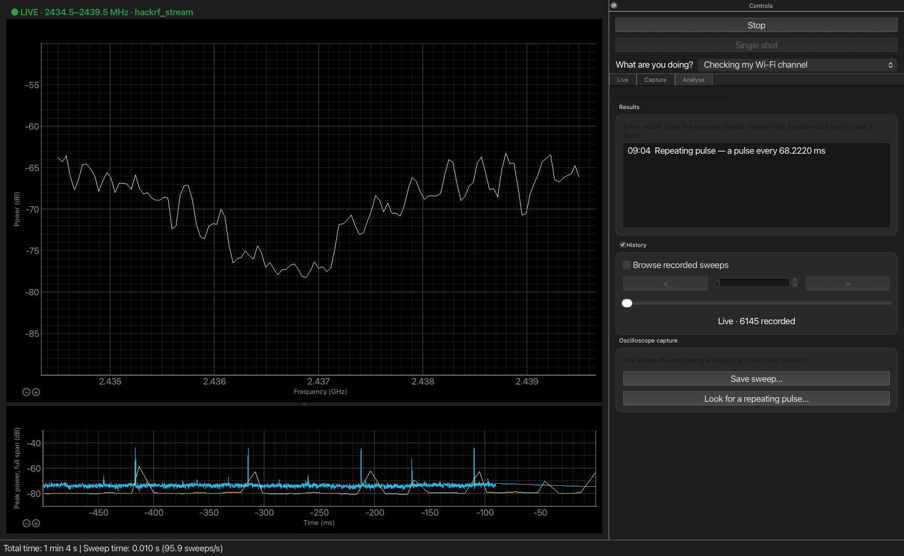
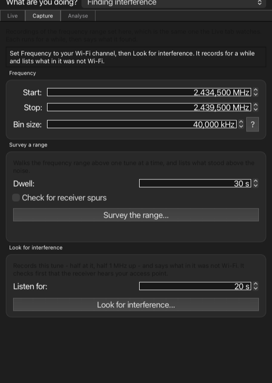

QSpectrumAnalyzer
=================

Spectrum analyzer for multiple SDR platforms (PyQtGraph based GUI for soapy_power,
hackrf_sweep, rtl_power, rx_power and other backends) — with, in this fork, a
HackRF backend fast enough to see individual bursts, and the tools to find them.

*Wi-Fi channel 6 on a HackRF One with the hackrf_stream backend: 1500 spectra a
second made, every one folded into the 95 a second drawn. Max hold (red) traces
the channel's 20 MHz mask; each white stripe in the waterfall is traffic.*

About this fork
---------------

QSpectrumAnalyzer is the work of **Michal Krenek (Mikos)**, who wrote it, its
backends and `soapy_power <https://github.com/xmikos/soapy_power>`_, and
maintained it for years at
`xmikos/qspectrumanalyzer <https://github.com/xmikos/qspectrumanalyzer>`_.
Everything here stands on that: the plot widgets, the backend architecture, the
settings, the very idea of a fast, lightweight GUI over command line sweepers.
If you want the general purpose tool, with packages for Arch, Ubuntu and
Windows, start there.

This fork started as a fix for the waterfall on an Apple Silicon Mac and turned
into something more specific: **hunting signals that are only there
occasionally** — a radar sweeping past, a burst, a Wi-Fi beacon — with a
HackRF. Sweeping is the wrong tool for that (it throws away most of what it
could have heard), so the fork adds a backend that stays on one frequency and
uses every sample, a zero span oscilloscope to watch power against time, and
recordings that say what they found. `HUNTING.md <HUNTING.md>`_ explains the
reasoning, with measurements.

The original backends are all still here and still work.

What is different
-----------------

**Faster, and on Qt 6**

- Ported to Qt 6 through PySide6.
- The spectrum, waterfall and scope redraw on one shared frame clock, capped to
  the screen's rate, and curves are reduced to the screen's resolution before
  drawing. When the backend falls behind, the display backs off before samples
  are dropped rather than after.
- hackrf_sweep output is assembled in one pass; soapy_power works again.

**hackrf_stream backend**

- Holds a HackRF on one frequency and uses the whole USB stream: about 1500
  spectra a second against hackrf_sweep's ceiling of about 405 retunes, with a
  better noise floor rather than a worse one. The trade is span — 20 MHz at
  most — and wider ranges are handed over to another backend automatically.
- Moves the receiver's own carrier out of the span by offset tuning where it
  can, and shades it where it cannot, rather than showing a peak that is not
  on the air.
- Prints, at the start of every run, what the settings come to: bins, frame
  length, how much a pulse of a given width loses, which bins are filter
  roll-off rather than the air.
- It is now its own library:
  `hackrf_stream <https://github.com/lakjdfalken/hackrf_stream>`_.

**Zero span oscilloscope**

- Power against time, either across the whole span or in one band.
- A high-rate tap reads the FFT frames themselves, down to one reading every
  25.6 µs, with peak, mean or total detectors.
- Trigger on a rising edge, with pre-trigger and single capture, and a trigger
  level taken from the shape of the noise.

**Built around the job, not the controls**

- *What are you doing?* picks the job — looking around a band, checking a
  Wi-Fi channel, catching short pulses, surveying a range, finding
  interference, going back over a recording — and shows the tab and examples
  for it.
- The panel is split into **Live**, **Capture** and **Analyse** tabs, with
  groups that fold.
- Presets for airband, Wi-Fi beacons at 2.4, 5 and 6 GHz, C- and S-band radar,
  and aircraft transponders, each with a note saying why it is set the way it
  is.
- *Check my receiver* says whether the gain is right and whether your access
  point is heard. The gain control fills the LNA before the VGA; the RF amp is
  only ever switched on by you.
- The Space bar starts and stops; Cmd/Ctrl + and − make all the text bigger
  or smaller.

**Recordings that report**

- *Survey the range* camps on each tune for a dwell instead of sweeping past it,
  asks each slice twice and keeps only what did not move, and writes what came
  and went to a CSV with the settings it was taken with.
- *Look for interference* records a tune twice, a megahertz apart, and lists
  what in it was not Wi-Fi.
- *Look for a repeating pulse* searches the scope's trace for a rhythm, folds
  it against detuned controls, and offers to set the scope to show it.
- The sweeps of a run are kept, up to a recording depth you set, and can be
  stepped through afterwards; every report lands in a results list on the Analyse tab.

Screenshots
-----------

*The Wi-Fi beacon preset on channel 6. The scope (bottom) shows the last half
second of power against time; the high-rate tap (blue) reads every 102.4 µs,
and the spikes roughly 100 ms apart are the access point's beacons.*

*The Analyse tab after a minute: the repeating pulse search's report in the
results list, 6145 sweeps recorded and ready to step through.*

*The Capture tab, for recordings that run for a while and then say what they
found.*

The original's screenshots, from before the fork, are on
`its project page <https://github.com/xmikos/qspectrumanalyzer>`_.

Requirements
------------

- Python >= 3.9
- PySide6 (Qt 6)
- PyQtGraph >= 0.13 (http://www.pyqtgraph.org)
- `hackrf_stream <https://github.com/lakjdfalken/hackrf_stream>`_, installed
  automatically — the plots use it even without a HackRF — and libhackrf
- soapy_power (https://github.com/xmikos/soapy_power)
- Optional: hackrf / rtl-sdr / rtl_power_fftw / rx_tools

Installation
------------

From this repository:
::

    git clone https://github.com/lakjdfalken/qspectrumanalyzer.git
    cd qspectrumanalyzer
    python3 -m venv .venv
    .venv/bin/pip install .
    .venv/bin/qspectrumanalyzer

macOS
*****

The fork is developed on an Apple Silicon Mac. The native tools come from
Homebrew:
::

    brew install hackrf rtl-sdr

soapy_power can live in a virtual environment of its own; it is run as an
executable, so it does not need to be importable from this one. Point
*Settings → Executable* at it if it is not on your PATH. `MACOS.txt <MACOS.txt>`_
has the details, including regenerating the Qt Designer files.

Linux and Windows
*****************

The steps above work anywhere Python, PySide6 and libhackrf do, but the fork
is only tested on macOS. The packages for Arch Linux (AUR), Ubuntu (PPA plus
``pip install qspectrumanalyzer``) and the Windows installers are the
original's, and install upstream QSpectrumAnalyzer without these changes;
their instructions are in the
`upstream README <https://github.com/xmikos/qspectrumanalyzer#installation>`_.
The dependencies they describe — SoapySDR and its drivers, Zadig on Windows —
are the same here.

Usage
-----

Start QSpectrumAnalyzer by running ``qspectrumanalyzer`` (or
``python -m qspectrumanalyzer``).

Pick what you are doing at the top of the panel, choose an example or set
Start and Stop, and press Start or Space. The backend is chosen in *File →
Settings* (*Preferences* on macOS); with a HackRF, choose ``hackrf_stream``.

For consistent results, set the gain by hand rather than leaving it automatic.
You can move and zoom the plots with the mouse, and change or export them from
the right-click menu. The waterfall's colour levels are set in the levels
meter.

For hunting something intermittent — why surveying beats sweeping, why the
detector matters more than the bin size, how far the gain can go — read
`HUNTING.md <HUNTING.md>`_ first.

Backends
--------

hackrf_stream
*************

The fork's backend for the HackRF One: one tune, up to 20 MHz, every sample
used, about 1500 spectra a second, and the high-rate tap behind the
oscilloscope. A range wider than one tune is handed over to the next backend
in line, such as ``soapy_power``.

soapy_power
***********

- **soapy_power** (https://github.com/xmikos/soapy_power)

``soapy_power`` is the original's default and recommended universal SDR
backend. It is based on `SoapySDR <https://github.com/pothosware/SoapySDR>`_
and supports nearly all SDR platforms (RTL-SDR, HackRF, Airspy, SDRplay,
LimeSDR, bladeRF, USRP and some other SDR devices). It is highly configurable
(see additional parameters help in *Settings* menu) and supports short
acquisition time for near real-time continuous measurement.

Other backends
**************

- **hackrf_sweep** (https://github.com/mossmann/hackrf)

``hackrf_sweep`` enables wideband spectrum monitoring by rapidly retuning the
radio without requiring individual tuning requests from the host computer,
for a sweep rate of up to 8 GHz per second. Only HackRF is supported. It is
the tool for covering a wide range quickly; ``hackrf_stream`` is the tool for
not missing anything in a narrow one.

- **rtl_power_fftw** (https://github.com/AD-Vega/rtl-power-fftw)

``rtl_power_fftw`` is an alternative backend for RTL-SDR devices with various
benefits over ``rtl_power``, e.g. better FFT performance (thanks to the
``fftw`` library) and short acquisition times for near real-time continuous
measurement (the minimum interval in the original ``rtl_power`` is 1 second).

- **rtl_power** (https://github.com/keenerd/rtl-sdr)

``rtl_power`` is the original backend for RTL-SDR devices. If you use it, use
`Keenerd's fork of rtl-sdr <https://github.com/keenerd/rtl-sdr>`_, because
``rtl_power`` in the osmocom.org package is broken (especially when used with
cropping).

- **rx_power** (https://github.com/rxseger/rx_tools) *[unsupported]*

``rx_power`` (part of ``rx_tools``) is also based on SoapySDR, but is much
slower than soapy_power, has a minimum interval of 1 second, and is buggy. It
was already unsupported upstream; patches are welcome.

Credits and license
-------------------

QSpectrumAnalyzer was created by Michal Krenek (Mikos) and its contributors —
see the `upstream repository <https://github.com/xmikos/qspectrumanalyzer>`_
and its history, which this fork keeps. The fork's changes are by
`lakjdfalken <https://github.com/lakjdfalken>`_.

It builds on `PyQtGraph <http://www.pyqtgraph.org>`_, `Qt for Python
<https://doc.qt.io/qtforpython/>`_, `SoapySDR
<https://github.com/pothosware/SoapySDR>`_ and the `HackRF
<https://github.com/greatscottgadgets/hackrf>`_ tools.

Licensed, like the original, under the GNU General Public License v3 — see
`LICENSE <LICENSE>`_.
